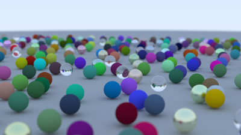

# Ray Tracing in C++

A simple ray tracing implementation based on "Ray Tracing in One Weekend" series.

## Demo



Sample render from the ray tracer showing spheres with 0different materials including diffuse, metal, and glass surfaces.


## Features
- Physically-based rendering with reflection, refraction, and diffuse materials
- Support for spheres with various materials (diffuse, metal, glass)
- Movable camera with depth of field
- Motion blur and BVH (Bounding Volume Hierarchy) for optimization

## How to compile
The project uses a Makefile for compilation:

```bash
make        # Compile source files and generate executable
make run    # Run the program and generate output.ppm
make clean  # Remove build files and output.ppm
```

## Viewing the output
The program outputs a PPM image file. You can use various image viewers or converters to view/convert this file.